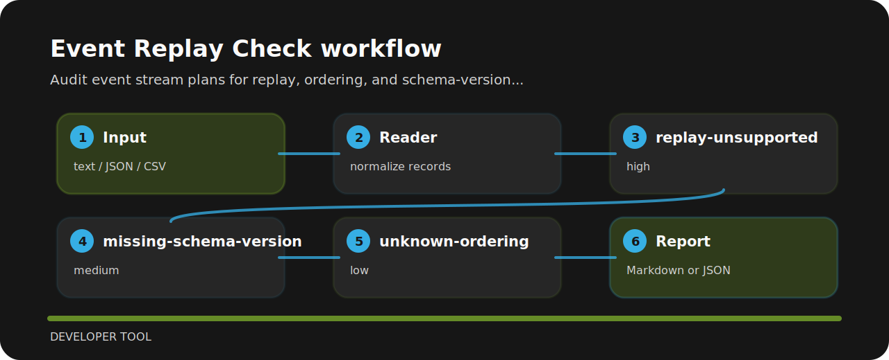

# Event Replay Check

| Detail | Value |
| --- | --- |
| Area | developer tool |
| Entry | `event-replay-check` |
| Input | plain text |
| Output | terminal findings, optional JSON |


## Why this exists

Event Replay Check is meant for quick pull-request checks around event systems. It favors explicit rules over a bulky dashboard.

## Finding map



## Review notes

- `replay-unsupported` - event replay is unsupported (high); Define replay source and retention window..
- `missing-schema-version` - schema version is missing (medium); Version event payloads..
- `unknown-ordering` - ordering guarantee is unclear (low); Document ordering key and consumer expectations..

## Run the sample

```bash
git clone https://github.com/mertefekurt/event-replay-check.git
cd event-replay-check
python -m pip install -e ".[dev]"
event-replay-check examples/sample.txt
```
