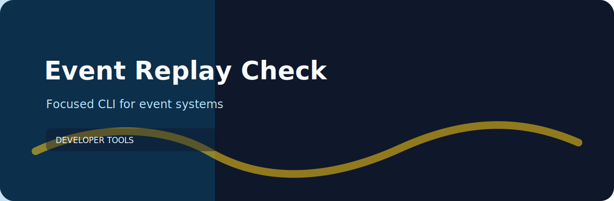

# Event Replay Check



Audit event stream plans for replay, ordering, and schema-version readiness. This repo keeps the work close to the terminal: clear input, predictable output, and no service to babysit.

## Event Replay Check catches

- `replay-unsupported` (high): event replay is unsupported. Fix: Define replay source and retention window..
- `missing-schema-version` (medium): schema version is missing. Fix: Version event payloads..
- `unknown-ordering` (low): ordering guarantee is unclear. Fix: Document ordering key and consumer expectations..

## A normal pass

```bash
git clone https://github.com/mertefekurt/event-replay-check.git
cd event-replay-check
python -m venv .venv
source .venv/bin/activate
python -m pip install -e ".[dev]"
event-replay-check examples/sample.txt
event-replay-check examples/sample.txt --json
```

The input can be text, JSON, JSONL, or CSV. Use `--json` when another script needs the result instead of a Markdown report.

## A deliberately bad line

```text
event order.created replay unsupported schema_version missing ordering unknown
```

## Maintainer loop

```bash
ruff check .
pytest
python -m event_replay_check --help
```
